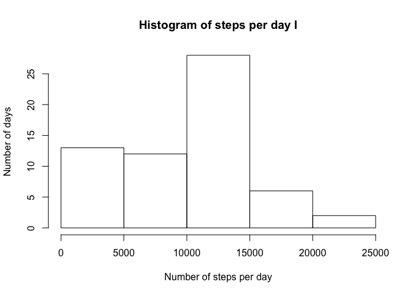
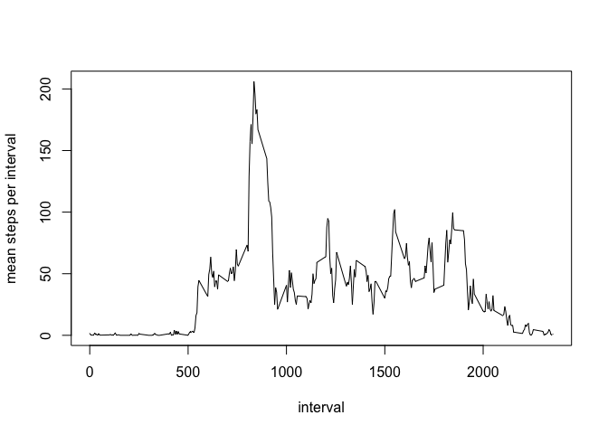
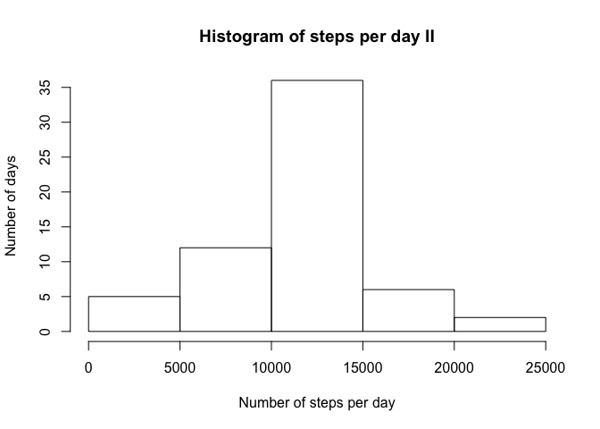
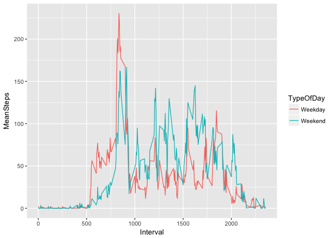

# Reproducible Research: Peer Assessment 1


## Loading and preprocessing the data 
 
- Loading the data, header inclusive, assuming the working directory has been set;  
- Processing the data to store totals per day while NA values are omitted.


Loading data and calculating total number of steps per day.

```r
ActivityData <- read.csv("activity.csv", header = TRUE)
MyStepsPerDay <- aggregate(ActivityData$steps, list(ActivityData$date),sum, na.rm=TRUE)
colnames(MyStepsPerDay) <- c("Date","StepsPerDay")
```

For verification purposes whe check the totals of the 'raw' ActivityData and the totals of the steps per day.

```r
sum(ActivityData$steps,na.rm=TRUE)
```

```
## [1] 570608
```

```r
sum(MyStepsPerDay$StepsPerDay)
```

```
## [1] 570608
```

## Display of histogram - steps per day 


```r
hist(MyStepsPerDay$StepsPerDay,main="Histogram of steps per day",xlab="Number of steps per day",ylab="Number of days")
```

<!-- -->

## Reporting mean steps per day I
The result has been rounded.

```r
round(mean(MyStepsPerDay$StepsPerDay))
```

```
## [1] 9354
```
## Reporting median steps per day I
The result has been rounded

```r
round(median(MyStepsPerDay$StepsPerDay))
```

```
## [1] 10395
```

## What is the average daily activity pattern?
The plot below reports abouts intervals averaged across all days.

```r
MyTs <- tapply(ActivityData$steps,ActivityData$interval,mean, na.rm=TRUE)
MyTsDf <- data.frame(interval=as.numeric(names(MyTs)), MeanSteps=MyTs)
plot(MyTsDf$interval,MyTsDf$MeanSteps,type="l",xlab="interval",ylab="mean steps per interval")
```

<!-- -->

The interval(s) that on average across all the days contain(s) the most number of steps is reported below. Theoretically more than one interval may contain this maximum.


```r
MyTsDf[ MyTsDf$MeanSteps == max(MyTsDf$MeanSteps),]$interval
```

```
## [1] 835
```
## Imputing missing values

Not for all intervals data has been provided. The total number of intervals during October and November without step data is 2304. These intervals receive the average value for those intervals based on the intervals with data.

```r
for (i in as.numeric(rownames(ActivityData[is.na(ActivityData$steps),])))
{
        ActivityData[i,]$steps <- MyTsDf[ MyTsDf$interval == (ActivityData[i,]$interval),]$MeanSteps
}
```

## Display of histogram - steps per day II
Intervals with NA values are replaced with mean values for that particular interval

```r
MyStepsPerDay2 <- aggregate(ActivityData$steps, list(ActivityData$date),sum)
colnames(MyStepsPerDay2) <- c("Date","StepsPerDay")
hist(MyStepsPerDay2$StepsPerDay,main="Histogram of steps per day II",xlab="Number of steps per day",ylab="Number of days")
```

<!-- -->

## Reporting mean steps per day II
The result has been rounded 

```r
round(mean(MyStepsPerDay2$StepsPerDay))
```

```
## [1] 10766
```
## Reporting median steps per day II
The result has been rounded

```r
round(median(MyStepsPerDay2$StepsPerDay))
```

```
## [1] 10766
```
## Differences in activity patterns between weekdays and weekends 
The diagrams below show activity patterns on weekdays and in weekends.


```r
# Add "type of day" to all records, assuming wday=0 is used for Sunday and wday=6 for Saturday
ActivityData["TypeOfDay"] <- "Weekday" 
ActivityData[as.POSIXlt(ActivityData$date)$wday==0,]$TypeOfDay <- "Weekend"
ActivityData[as.POSIXlt(ActivityData$date)$wday==6,]$TypeOfDay <- "Weekend"

AggData <- aggregate(ActivityData$steps,by=list(interval=ActivityData$interval,TypeOfDay=ActivityData$TypeOfDay),FUN=mean)
colnames(AggData) <- c("Interval","TypeOfDay","MeanSteps")

p <- ggplot(AggData,aes(x=Interval,y=MeanSteps,group=TypeOfDay,colour=TypeOfDay))+ geom_line()
print(p)
```

<!-- -->
